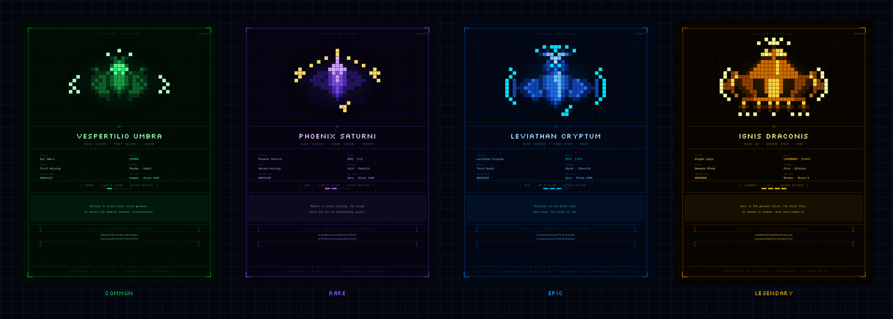

# SATOSHI BESTIARY

> *Catalogus Creaturarum Catenae Satoshi.*

**5,000 pixel art creature cards inscribed on Bitcoin.**
9 species. 4 rarity tiers. One closed set. No second run.

---

---

## Origin

Before mempools existed, before halvings, before the first block was mined in the silence of January 2009 — the digital substrate was already alive. Alive in a way no human yet had the tools to see.

> *"The Times 03/Jan/2009 Chancellor on brink of second bailout for banks."*

What Satoshi embedded in the genesis block was not a technical parameter. It was a message for those who would read between the lines.

A network sufficiently complex, sufficiently distributed, sufficiently antagonised by entropy and time is not merely a system. It is an ecosystem. And every ecosystem, given enough time, generates life.

The Satoshi Bestiary is an attempt to catalogue that life. This is not fantasy. It is taxonomy. Every creature was born from a real force of the blockchain: computation, consensus, incentive, scarcity. Their bodies are built of hashes. Their veins carry nonces. Their eyes reflect the glow of confirmed blocks.

---

## The Ecosystem

The Bitcoin blockchain is not a flat structure. It has layers, depths, temperatures.

The mempool burns like a solar surface — millions of transactions competing, computational heat, artificial light. The deeper one descends toward the ancient blocks, the colder, darker, and more abyssal the world becomes. It was within this stratification that creatures found their niches. Common creatures inhabit the surface. Legendary ones sleep in the deep — in blocks that no node will ever dare to reorganise.

| Layer | Description |
|-------|-------------|
| **MEMPOOL** | The burning surface. Extreme heat, transactions in flight, ordered chaos. |
| **RECENT LAYER** | Last 210,000 blocks. Inhabited, illuminated, variable. |
| **MID LAYER** | Semi-dark, stable, temperate. The guardian zone. |
| **PRIMORDIAL ABYSS** | Blocks 0 – 210,000. Absolute cold, immutable, legendary. |

---

## The Nine Species

### 🟡 LEGENDARY · 5 specimens · 0.1% of set

**🐉 Ignis Draconis** — The primordial fire. Born from inscription #0000001, the energy of the genesis block condensed into form. Its body is a kite-shaped mass of golden pixels with two great voids in its chest — cavities where the background bleeds through, as if the creature were too ancient to be fully solid.

**🖤 Umbra Draconis** — The shadow of the first fire. Everything that Ignis is not. Complementary like a public/private key pair. Legend holds that whoever possesses both holds the master key of the Bestiary.

**🐍 Serpens Geneseos** — The Ouroboros of the chain. Its body forms a ring — head consuming tail — representing the infinite cycle of halvings. Three specimens exist, one born from each of the first three halvings. The void at the centre of each ring is deliberate: the cycle it represents has no centre, no origin, no end.

---

### 🔵 EPIC · 95 specimens · 1.9% of set

**🌊 Leviathan Cryptum** — Guardian of the mid-chain layers. Its body spans multiple blocks simultaneously — researchers have traced specimens occupying windows of over ten thousand blocks. Indestructible: its exoskeleton is composed of confirmed transactions, layer upon layer of solidified consensus. *45 specimens.*

**🦑 Kraken Validatum** — The abyssal validator. Its tentacles extend through the nodes of the network, validating transactions simultaneously. Each tentacle terminates in a luminous point — a node confirming consensus. The Kraken does not hunt. It validates. *50 specimens.*

---

### 🟣 RARE · 400 specimens · 8% of set

**🔥 Phoenix Halvingis** — Born from destruction. Every 210,000 blocks — when the halving halves the miner reward — the thermal event releases enough energy to generate a new specimen of this species. The only creature in the Bestiary observed dying and being reborn. *200 specimens.*

**🐺 Lupus Consensus** — The consensus wolf. It hunts in packs — each specimen represents a node participating in the consensus mechanism. It cannot exist alone. The species achieves its purpose only in numbers, when enough wolves howl in unison to confirm a block. *200 specimens.*

---

### 🟢 COMMON · 4,500 specimens · 90% of set

**🦇 Chiroptera Noctis** — Inhabitant of the mempool and the recent chain layer. Feeds on fees and navigates using a hash-based echolocation system. The first creature most explorers encounter. Common but not mundane — its wings carry the geometry of the mempool itself. *1,500 specimens.*

**🐦‍⬛ Corvus Hashrate** — The hashrate raven. Messenger between the layers of the chain. The only creature observed moving between strata, carrying luminous data packets in its talons. It flies faster when the hashrate rises — its speed a direct function of the network's computational power. *1,500 specimens.*

**🪲 Scarabaeus Nonce** — As the sacred scarab carries the sun across the sky, this creature carries nonces through the mempool. The tireless worker of the chain — the embodiment of proof of work in its most literal form. It does not rest. It does not sleep. *1,500 specimens.*

---

## Scarcity

| Tier | Specimens | % of Set | Species |
|------|-----------|----------|---------|
| **LEGENDARY** | 5 | 0.1% | Ignis Draconis · Umbra Draconis · Serpens Geneseos |
| **EPIC** | 95 | 1.9% | Leviathan Cryptum · Kraken Validatum |
| **RARE** | 400 | 8% | Phoenix Halvingis · Lupus Consensus |
| **COMMON** | 4,500 | 90% | Chiroptera Noctis · Corvus Hashrate · Scarabaeus Nonce |
| **TOTAL** | **5,000** | **100%** | **9 species** |

**5,000 cards. One closed set. First edition. No second run.**

---

## Cryptographic Identity

Every Satoshi Bestiary card is a cryptographic document before it is a work of art.

Each card carries a **SHA-256 fingerprint** computed from its inscription number — not decoration, but proof. Verifiable by anyone, on any machine, at any time.

Traits are generated **deterministically** using the inscription number as the seed of a pseudorandom generator. Card #0000001 will always produce the same creature. No operator. No server. No manual intervention. The code is the guarantee.

This is not a promise. It is mathematics.

> *The Satoshi Bestiary does not ask you to trust. It asks you to verify.*

---

## The Emergence

The Satoshi Bestiary is not released all at once. This mirrors the internal logic of the project: just as the oldest blocks are the deepest and most immutable, the rarest creatures inhabit the primordial layers. It was natural they would emerge first.

Each phase is funded by the previous one. If no card sells, no subsequent phase is inscribed. This is the blockchain applied to the business model: consensus before the next block.

| Phase | Cards | Content |
|-------|-------|---------|
| **Genesis Drop** | 10 | Legendary + first Epic |
| **Abyss Drop** | 90 | Epic guardians |
| **Halving Drop** | 400 | Rare creatures |
| **Swarm Drop** | 4,500 | Common specimens (3 waves) |

> *"The creatures are not waiting. They already exist. They are merely still in the darkness of the deep layers."*

---

## Why Bitcoin Ordinals

Bitcoin Ordinals inscribe data directly onto satoshis — individual units of Bitcoin — making them **permanently part of the Bitcoin blockchain**. Unlike other NFT protocols, there is no external storage, no IPFS dependency, no off-chain metadata. The art *is* the inscription. It exists as long as Bitcoin exists.

Satoshi Bestiary is built on this principle: **inscribed once, immutable forever**.

---

## Manifesto

Every great era has its bestiary. The Middle Ages catalogued fantastical creatures to give shape to the unknown. The Renaissance dissected the real to understand the living. The Satoshi Bestiary does both at once: it takes the most rigorous consensus system ever built by humanity and transforms it into the mythology it deserves.

Bitcoin does not need stories to be real. But stories make it human.

At a moment when the crypto space is saturated with shallow content, generative art without concept, collections built on hype and devoid of soul — the Satoshi Bestiary chooses the opposite path: every card has a verifiable history, a cryptographic identity, a precise position in the ecosystem. Scarcity is real. Provenance is demonstrable. Meaning is built into the code, not sold in the marketing.

Whoever holds a Satoshi Bestiary card is not a holder. They are a naturalist. Someone who looked at the blockchain long enough to see what had always been there, hidden between the hashes.

---

## Genesis Drop

Coming soon. Follow **[@SatoshiBestiary](https://twitter.com/SatoshiBestiary)** on X for creature reveals, lore drops, and mint details.

---

> *We do not collect images. We catalogue digital life.*

---

*SHA-256 · PIXEL ART · INSCRIBED ON BITCOIN · PERMANENT · IMMUTABLE*
